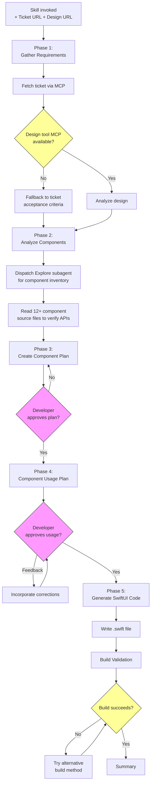
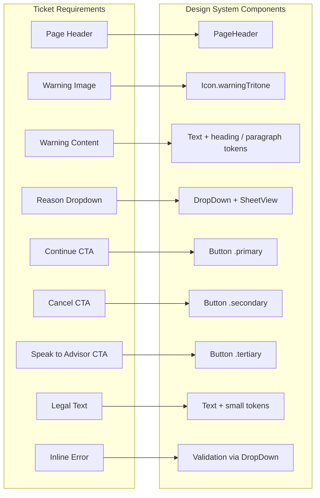
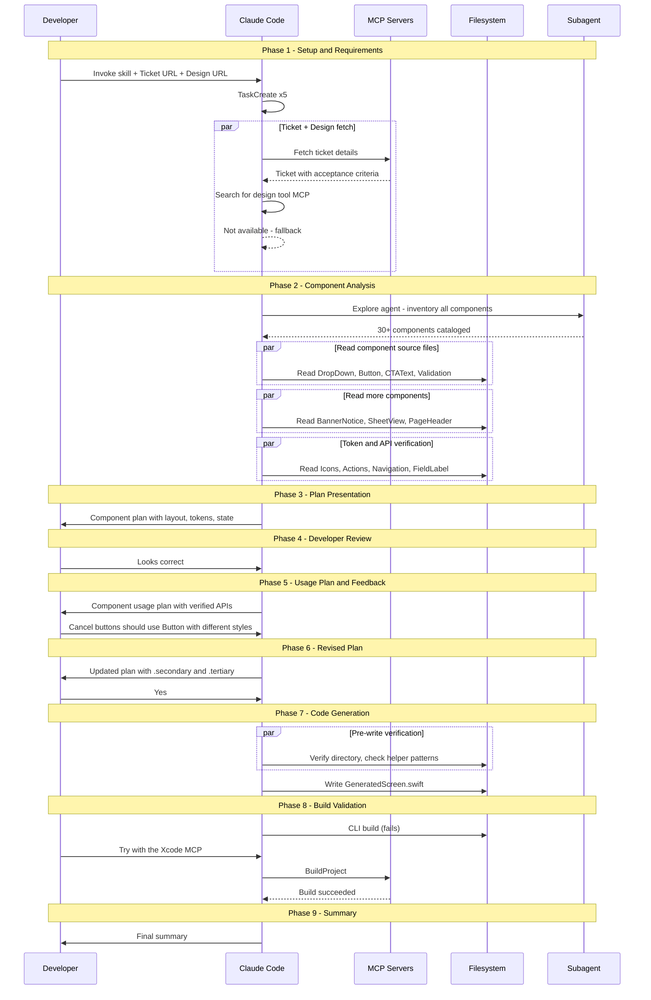
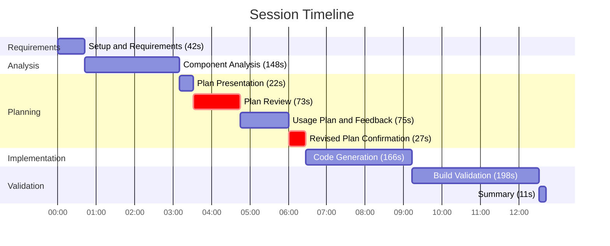
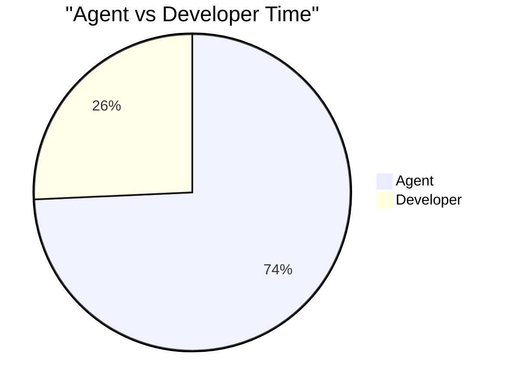
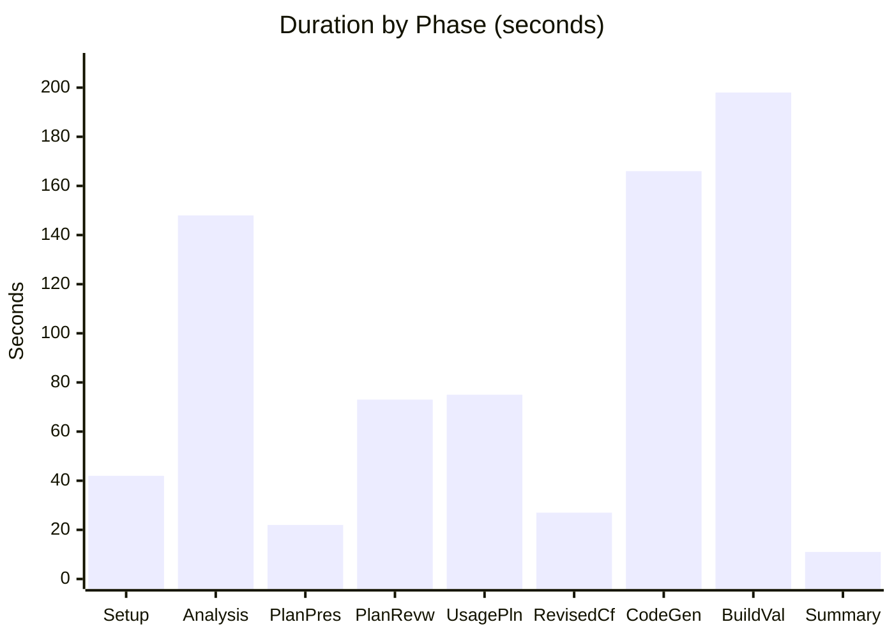

# cc-session-analyzer

A Claude Code plugin that analyzes any session from `.jsonl` logs and generates a comprehensive markdown report with mermaid visualizations. Works with skill-driven workflows, general coding sessions, debugging, or any multi-step task.

## Installation

```shell
/plugin marketplace add carterTsai95/cc-session-analyzer
/plugin install cc-session-analyzer@cc-session-analyzer
```

## Usage

Invoke the skill:

```shell
/cc-session-analyzer
```

Or ask naturally: "analyze this session", "generate a session report", "what happened in this session".

### 3-Checkpoint Workflow

The analyzer walks you through 3 checkpoints before generating the report:

**Checkpoint 1 — Session Discovery**
Identifies the session log, detects if a skill was used, and presents basic metrics (duration, agent/developer time split, tool call counts). You confirm the correct session before proceeding.

**Checkpoint 2 — Phase Segmentation**
Segments the session timeline into phases (exploration, implementation, validation, etc.) using heuristic analysis. You review and can adjust phase boundaries, merge, split, or rename phases.

**Checkpoint 3 — Report Preview**
Shows the planned report structure and output path. Uses a unified template for all session types — skill sessions include additional context (workflow flowchart, trigger phrases, file structure) while general sessions focus on task overview, approach, and files changed. You confirm before generation begins.

### Output

A markdown document with:
- Mermaid sequence diagram of the conversation flow
- Phase-by-phase execution breakdown
- Gantt chart of the session timeline
- Pie charts (agent vs developer time, phase breakdowns)
- Bar chart of duration by phase
- Metrics summary table
- Key observations and takeaway

All mermaid charts are GitHub-compatible.

## Session Types

| Type | Auto-detected by | Report focus |
|------|------------------|--------------|
| Skill session | `<command-name>/` in logs | Skill workflow, checkpoints, domain mapping |
| General session | No skill detected | Task summary, approach, files changed |

## Example Output

Below is a condensed example from a real session where a UI component skill generated a SwiftUI screen from a ticket. The full report includes all sections shown here.


<summary><strong>Session Analysis — Build SwiftUI Screen from Ticket</strong></summary>

### Task Overview

A skill session that converted a ticket into a production-ready SwiftUI screen using a design system component library. The skill automated requirements gathering, component analysis, plan creation with developer checkpoints, code generation, and build verification — completing in 13 minutes with 3 developer checkpoints.

**Input:** Ticket URL + design tool URL  
**Output:** A compilable SwiftUI screen using 5 design system components with proper tokens, accessibility, and state management.

### Workflow Overview



### Project Context

#### Files Changed

| File | Action | Summary |
|------|--------|---------|
| `Sources/.../GeneratedScreen.swift` | Created | SwiftUI screen with page header, dropdown, 3 buttons, warning icon, legal text, category selection sheet, inline validation |

#### Ticket-to-Component Mapping



### Session Walkthrough

#### Execution Breakdown



#### Key Observations

1. **Design tool fallback was seamless.** The design tool MCP wasn't available, but the ticket's detailed acceptance criteria provided sufficient requirements. The skill adapted without blocking.

2. **Subagent delegation was the right call.** The Explore subagent spent 67s cataloging 30+ components in parallel while the main agent retained context for synthesis.

3. **Component file reading was thorough.** 16 Read calls across 13 component files ensured API verification before code generation.

4. **Developer checkpoints caught a real issue.** The developer corrected the CTA approach from text links to styled buttons — a design decision that couldn't be automated.

5. **Build validation was the biggest bottleneck.** Phase 8 consumed 198s (24% of total) due to two failed CLI build approaches before the user directed to the Xcode MCP.

6. **The Xcode MCP build took 47s but worked first try.** Once directed to the right tool, validation completed with zero errors.

7. **Agent time dominated at 74%.** Only 3 user messages contained substantive input. The rest was automated tool orchestration.

#### Duration and Metrics







> **Legend:** Setup = Setup & Requirements, Analysis = Component Analysis, PlanPres = Plan Presentation, PlanRevw = Plan Review, UsagePln = Usage Plan & Feedback, RevisedCf = Revised Plan Confirmation, CodeGen = Code Generation, BuildVal = Build Validation

| Metric | Value |
|--------|-------|
| Total duration | 13m 32s |
| Agent time | 604s (74.2%) |
| Developer time | 209s (25.8%) |
| Total tool calls | 57 |
| Files created | 1 |
| Components used | 5 |
| Components evaluated | 13 |
| User turns | 11 |
| Subagents dispatched | 1 (Explore) |
| MCP servers used | 2 |
| Developer checkpoints | 3 |
| Developer corrections | 1 |
| Build attempts | 3 (2 failed, 1 succeeded) |

#### Takeaway

The skill converted a ticket into a compilable, 230-line SwiftUI screen in 13.5 minutes, with 74% of the time fully automated. The agent handled requirements extraction, component library analysis (reading 13 source files), plan synthesis, and code generation without intervention. Developer time was concentrated in three checkpoints that validated design decisions — one of which caught a meaningful style correction that improved the button hierarchy. The main inefficiency was build validation (198s, 24% of total), where two CLI-based build approaches failed before the developer redirected to the Xcode MCP, which succeeded on the first attempt.


## License

MIT
