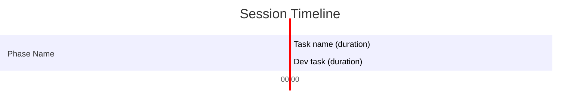
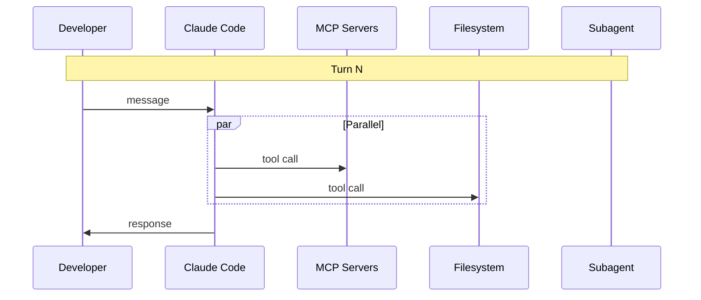
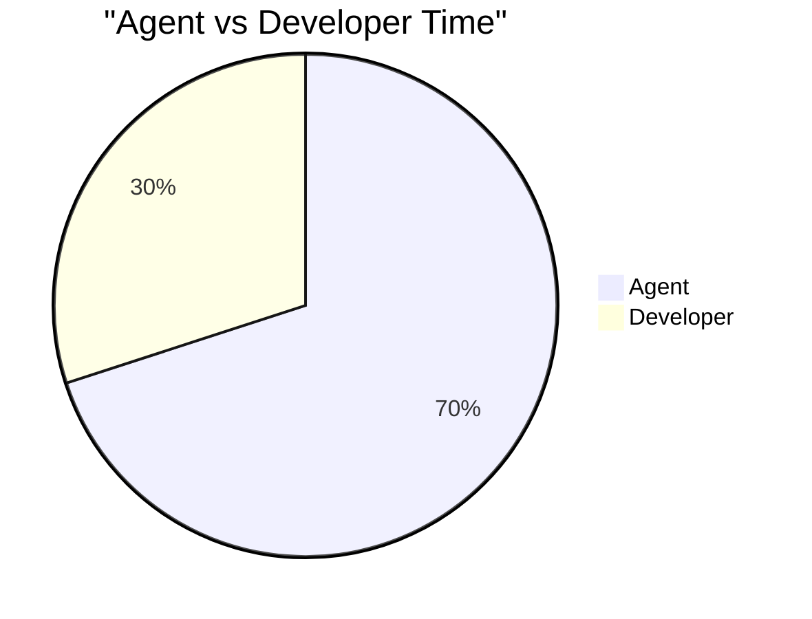
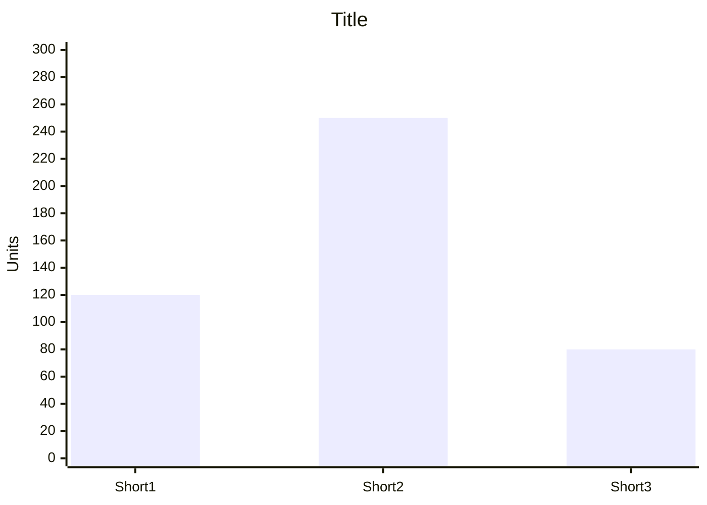
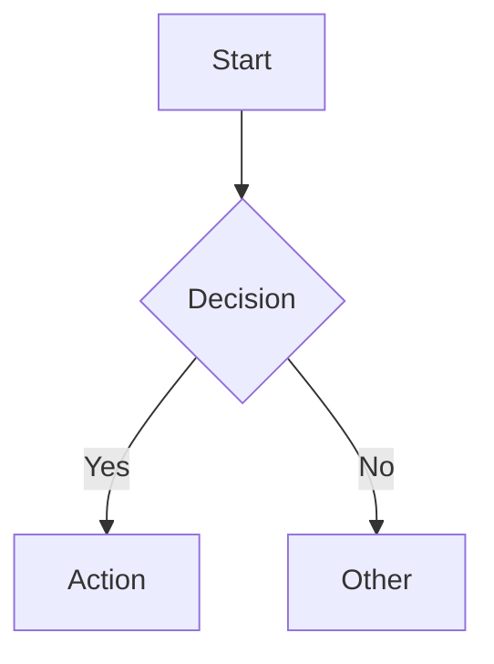

# Analysis Document Output Templates

Two templates based on session type. Adapt section content to the specific session analyzed.

---

## Skill Session Template

```
# Skill — `<skill-name>` Analysis and Demo

<1-2 sentence skill description>

## Table of Contents
- How It Works
- <Domain-Specific Mapping Section> (varies per skill)
- Trigger Phrases
- Skill File Structure
- Real-World Demo: <ticket-id or description>
  - How the Skill Was Invoked
  - Workflow Execution Breakdown
  - Key Observations
  - Task Duration and Metrics
  - Takeaway

## How It Works
<Mermaid flowchart showing the skill's checkpoint/workflow structure>

## <Domain-Specific Section>
<Mermaid diagram showing the skill's core data transformation (input -> output).
Name this section based on what the skill does, e.g., "Confluence to xcstrings Mapping">

## Trigger Phrases
<List of phrases that activate the skill, from SKILL.md description>

## Skill File Structure
<Directory tree of the skill>

## Real-World Demo: <ticket-id or description>

### How the Skill Was Invoked
<What the user typed, what it loaded>

### Workflow Execution Breakdown
<Mermaid sequence diagram>
<Phase table: Phase | What Happened | Tools Used | User Gate?>

### Key Observations
<5-8 numbered insights>

### Task Duration and Metrics
<Gantt chart, phase table, pie charts, bar chart, metrics summary>

### Takeaway
<1 paragraph summary>
```

---

## General Session Template

```
# Session Analysis — <task description>

<1-2 sentence summary of what was accomplished>

## Table of Contents
- Task Overview
- Approach
- Files Changed
- Session Breakdown
  - Conversation Flow
  - Workflow Execution Breakdown
  - Key Observations
  - Task Duration and Metrics
  - Takeaway

## Task Overview
<What the user asked for and what was delivered. Include context and motivation if apparent.>

## Approach
<Mermaid flowchart showing the steps taken — exploration, planning, implementation, validation>

## Files Changed
| File | Action | Summary |
|------|--------|---------|
| `path/to/file` | Created/Modified/Deleted | Brief description |

## Session Breakdown

### Conversation Flow
<Mermaid sequence diagram showing actual session flow>

### Workflow Execution Breakdown
<Phase table: Phase | What Happened | Tools Used | Duration>

### Key Observations
<5-8 numbered insights about the session>

### Task Duration and Metrics
<Gantt chart, phase table, pie charts, bar chart, metrics summary>

### Takeaway
<1 paragraph summary>
```

---

## Mermaid Chart Formats

### Gantt Chart (use `after` syntax for GitHub compatibility)

- First task uses `2024-01-01 00:00:00` as start (not real timestamps)
- Mark developer time phases with `:crit` (renders red)
- No special characters in task IDs

### Sequence Diagram

- Only include participants that appear in the session
- Group parallel tool calls in `par` blocks
- Use `Note over` for turn boundaries

### Pie Chart

- Values must be numbers, not percentages

### Bar Chart (keep x-axis labels SHORT — max 10 chars)

- Add a legend below the chart if labels need explanation

### Flowchart


---

## Phase Duration Table Format

| Phase | Duration | Agent/Dev | Tool Calls | Bottleneck |
|-------|----------|-----------|------------|------------|
| Phase name | Xs | Agent/Dev | N | Description or — |

## Metrics Summary Table Format

| Metric | Value |
|--------|-------|
| Total duration | Xm Ys |
| Agent time | Xs (X%) |
| Developer time | Xs (X%) |
| Total tool calls | N |
| Files modified | N |
| User turns | N |
| ... (session-specific) | ... |
